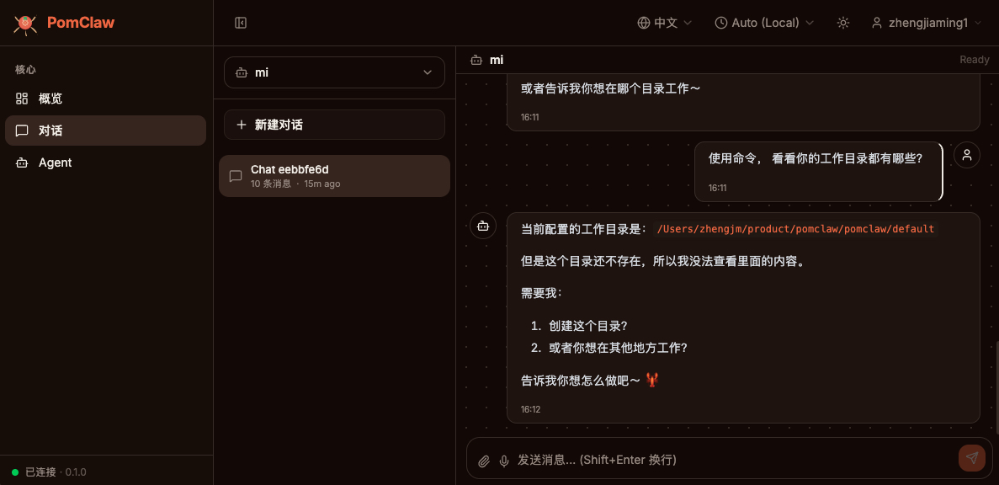

# PomClaw

**Enterprise-Grade Distributed AI Agent Platform**

<p>
  
  
  
  
  
</p>

[English](#-overview) | [中文](README.md)

---

## 🎯 Overview

PomClaw is an enterprise-grade platform designed to deploy AI Agents at scale with minimal infrastructure costs. Unlike personal-use solutions that require one VM per Agent, PomClaw enables **unlimited Agents on shared infrastructure** through:

- **Distributed Memory Storage**: Unified database for all Agent memories, conversations, and state
- **SSH Sandbox Execution**: Secure, isolated workspace execution without individual VMs
- **Multi-Tenant Isolation**: Support thousands of Agents with fine-grained security controls
- **90% Cost Reduction**: Serve N agents with M compute nodes (M ≈ N/10)

### Quick Comparison

| Aspect | Traditional | PomClaw |
|--------|-----------|---------|
| **Architecture** | 1 VM per Agent | Shared infrastructure |
| **Cost for 100 Agents** | 100 × $10/mo = $1000 | 10 × $10/mo = $100 |
| **Storage** | Local files | Distributed database |
| **Execution** | Local compute | SSH sandbox pool |
| **Scalability** | Linear with agents | Linear with dataset |
| **Management** | Individual VMs | Centralized platform |

---

## 🏗️ Technology Stack (Production-Grade Engineering)

PomClaw is built with **production-level engineering architecture** using mature industry frameworks:

### Backend Framework Stack
- **[go-zero](https://github.com/zeromicro/go-zero)** - Enterprise Microservice Framework
  - High-performance RPC and HTTP services
  - Automatic code generation and hot-reload support
  - Built-in circuit breaker, rate limiting, timeout controls
  - Distributed tracing and observability

- **[eino](https://github.com/cloudwego/eino)** - AI Agent Engineering Framework
  - Modular Agent architecture
  - Flexible tool chains and plugin systems
  - Built-in memory, planning, and reasoning capabilities
  - Complete LLM integration support

### Frontend Technology Stack
- **React 19** + TypeScript - Modern frontend framework
- **Vite** - Ultra-fast build tool
- **Jotai** - Atomic state management
- **TanStack Router** - Type-safe routing solution
- **Tailwind CSS** - Utility-first styling framework
- **shadcn/ui** - Accessible UI component library

### Data Persistence
- **PostgreSQL / Oracle** - Enterprise relational databases
- **pgvector** - Vector search and semantic retrieval
- Complete multi-tenant data isolation

### Why go-zero + eino?
✅ **Production-Ready** - Proven stability in thousands of enterprises
✅ **High-Performance** - Microsecond response times, support for tens of thousands of concurrent connections
✅ **Easy to Maintain** - Clear project structure and code generation
✅ **Highly Extensible** - Modular design for customization and scaling

---

## ✨ Core Features

### 🗄️ Distributed Memory Storage
- **Unified Backend**: PostgreSQL, Oracle, or any SQL database
- **Vector Search**: Built-in pgvector support for semantic search
- **Multi-Tenant**: Automatic isolation of data across organizations/agents
- **Persistence**: Complete conversation history, state, and metadata

### 🏗️ SSH Sandbox Execution
- **Secure Isolation**: Execute code in isolated environments without VM overhead
- **Flexible Deployment**: Connect any Linux/Unix server as execution node
- **Load Balancing**: Automatic distribution across multiple sandbox nodes
- **Resource Control**: Built-in timeout and resource limits

### 💰 Enterprise Economics
- **Infrastructure Consolidation**: Run 100s of agents on same hardware
- **On-Demand Scaling**: Add SSH nodes as needed, not agents
- **Reduced Operational Burden**: Centralized logging, monitoring, and updates
- **Legacy Integration**: Works with existing on-premises infrastructure

### 🔒 Security & Compliance
- **Multi-Tenant RBAC**: Organization and agent-level access control
- **Audit Logging**: Complete operational audit trail
- **Network Isolation**: VPC support, SSH key management, bastion host compatible
- **Data Encryption**: In-transit and at-rest encryption options

### 📊 Observability
- **Unified Dashboard**: Monitor all agents from one place
- **Real-Time Logs**: Stream agent execution logs and errors
- **Performance Metrics**: CPU, memory, execution time tracking
- **Distributed Tracing**: Full request tracing across system

---

## 🚀 Quick Start (10 minutes)

### Prerequisites
- **Go 1.24+**
- **Node.js 18+** (for frontend build)
- **PostgreSQL 13+** (or Oracle Database)
- **SSH access to sandbox nodes**

### 1. Clone and Build

```bash
git clone https://github.com/pomclaw/pomclaw.git
cd pomclaw
make build  # Automatically builds both backend and frontend UI
```

> **Note**: `make build` automatically:
> - Compiles the frontend UI (using `npm run build`)
> - Compiles the backend binary
> - Packages frontend into `dist/control-ui/` directory

### 2. Initialize Database

```bash
# Create database
createdb pomclaw

# Import database schema
psql pomclaw < docs/sql/pom_meta.sql
psql pomclaw < docs/sql/pom_users.sql
psql pomclaw < docs/sql/pom_agents_v2.sql
psql pomclaw < docs/sql/pom_config.sql
psql pomclaw < docs/sql/pom_memories.sql
psql pomclaw < docs/sql/pom_prompts.sql
psql pomclaw < docs/sql/pom_sessions.sql
psql pomclaw < docs/sql/pom_transcripts.sql
psql pomclaw < docs/sql/pom_daily_notes.sql
psql pomclaw < docs/sql/pom_state.sql
```

### 3. Start Gateway

```bash
./build/pomclaw

# Gateway starts on http://localhost:18790
# Frontend UI automatically served from: http://localhost:18790 (using dist/control-ui)
```

**Gateway Web UI:**



---

## 🎨 Frontend & Backend Integration

PomClaw uses a **decoupled frontend-backend architecture** while providing fully integrated deployment:

### Build & Deployment

**Backend**: Distributed AI Agent platform built on `go-zero` + `eino` frameworks
- go-zero provides high-performance RPC/HTTP service infrastructure
- eino provides complete Agent engineering framework (tool chains, memory, planning)
- WebSocket and HTTP API endpoints
- Agent lifecycle, memory, and execution management
- Built-in circuit breaker, rate limiting, distributed tracing, and full observability

**Frontend**: Modern web UI built with TypeScript + React
- Session management and real-time chat interface
- Multi-language and theme customization

### Integrated Deployment

Running `make build` automatically builds the complete application:
- ✅ Backend binary: `build/pomclaw-*`
- ✅ Frontend assets: `dist/control-ui/` (compiled from `ui/` directory)

Starting Gateway automatically serves the Web UI:
```bash
./build/pomclaw
# Access http://localhost:18790 to use the complete application
```

**Configuration**:
- Gateway's `ui_path` config defaults to `dist/control-ui`
- Customize UI path by modifying the configuration
- Frontend communicates with backend via WebSocket in real-time

---

## 📋 Architecture

```
┌──────────────────────────────────────────────────────────┐
│           Distributed Database (PostgreSQL/Oracle)       │
│  - Memories, conversations, state (multi-tenant)         │
│  - Vector embeddings with pgvector                       │
└──────────────────────────────────────────────────────────┘
                          ↑
                ┌─────────┼─────────┐
                ↓         ↓         ↓
         ┌──────────┐┌──────────┐┌──────────┐
         │SSH Node1 ││SSH Node2 ││SSH Node3 │
         │(Sandbox) ││(Sandbox) ││(Sandbox) │
         └──────────┘└──────────┘└──────────┘
                ↑         ↑         ↑
                └─────────┼─────────┘
                          │
    ┌─────────────────────┴─────────────────────┐
    │     PomClaw Gateway API + WebSocket        │
    │  (Single control plane for all agents)     │
    └─────────────────────┬─────────────────────┘
         ↑                 ↑                ↑
    ┌────────────┐   ┌────────────┐   ┌────────────┐
    │  Agent-1   │   │  Agent-2   │   │  Agent-N   │
    └────────────┘   └────────────┘   └────────────┘
```

---

## 🔧 Configuration

### Database Configuration

```json
{
  "storage_type": "postgres",
  "postgres": {
    "enabled": true,
    "host": "db.example.com",
    "port": 5432,
    "database": "pomclaw",
    "user": "pomclaw",
    "password": "${POSTGRES_PASSWORD}",
    "ssl_mode": "require",
    "pool_max_open": 25,
    "pool_max_idle": 5
  }
}
```

---

## 📚 Use Cases

### 🏢 Enterprise AI Customer Support
Scale from 10 to 1000+ support agents without proportional cost increase

### 🤖 Workflow Automation Platform
Distributed task execution engine for RPA, data processing, and business logic automation

### 📊 Data Analysis at Scale
Multi-tenant analytics platform with isolated workspaces for each user/organization

### 🔬 Research Computing
High-availability compute clusters for scientific simulations and data processing

### 🎓 Educational Platform
Manage AI assistants for thousands of students with isolated, secure workspaces

---

## 📊 Performance & Scaling

### Capacity Planning

| Configuration | Agents | Memory/Agent | CPU | Database |
|--------------|--------|-------------|-----|----------|
| Small | 100 | 256MB | 2-4 core | PostgreSQL 13 |
| Medium | 1,000 | 256MB | 8-16 core | PostgreSQL 14 |
| Large | 10,000 | 256MB | 32+ core | PostgreSQL 14+ or Oracle 21c |
| Enterprise | 100,000+ | 256MB | Multi-node | Distributed DB |

### Storage Requirements

- **Per Agent**: ~1MB metadata + 10MB conversations (varies by usage)
- **Vector Storage**: ~1,500 bytes per memory (384-dim embedding)

---

## 🔒 Security

### Authentication & Authorization
- OAuth2/SSO support for enterprise directories
- Organization-level and agent-level RBAC
- API key management with rotation

### Network Security
- SSH key-based authentication (no passwords)
- TLS 1.3 for all communications
- VPC/network isolation support
- Bastion host support for air-gapped deployments

### Data Protection
- Encryption at rest (database-level)
- Encryption in transit (TLS)
- Audit logging for all operations
- Data retention and compliance policies

---

## 🛠️ Development & Extension

### Engineering-First Development Experience

PomClaw is built on go-zero and eino frameworks, providing **enterprise-grade development experience**:

**go-zero Advantages**:
- ✅ `goctl` Code Generation - Auto-generate service templates and client code
- ✅ Unified Configuration Management - YAML configs automatically map to code structures
- ✅ Built-in Microservice Toolkit - Service mesh, RPC, rate limiting, circuit breaker
- ✅ Distributed Tracing - Quick identification of performance bottlenecks

**eino Advantages**:
- ✅ Plugin-Based Agent Design - Quick integration of new LLMs, tools, and memory sources
- ✅ Complete Engineering Examples - Clear learning path
- ✅ Type-Safe Data Flow - TypeScript-level type checking
- ✅ Built-in Debugging Tools - Trace Agent reasoning process

### Build from Source

```bash
git clone https://github.com/pomclaw/pomclaw.git
cd pomclaw
make build      # Build backend + frontend
make test
```

### Frontend Development

```bash
cd ui
npm install
npm run dev      # Development server (hot reload)
npm run build    # Production build
npm run preview  # Preview production build
```

### Backend Development

```bash
make run ARGS=gateway  # Quick build and run Gateway
```

### Run Tests

```bash
# Unit tests
make test

# Integration tests (requires Docker)
make test-integration

# All tests with coverage
make test-coverage
```

### Docker Deployment

```bash
docker-compose up -d
# Starts PostgreSQL, Redis, and PomClaw Gateway (with UI)
```

---

## 📖 Documentation

- [Architecture Guide](docs/STORAGE_ARCHITECTURE.md)
- [PostgreSQL Setup](docs/POSTGRESQL_SUPPORT.md)
- [API Reference](docs/API.md)
- [Deployment Guide](docs/DEPLOYMENT.md)
- [Security Guide](docs/SECURITY.md)

---

## 🤝 Contributing

Contributions welcome! Please:

1. Fork the repository
2. Create a feature branch (`git checkout -b feature/amazing-feature`)
3. Commit your changes (`git commit -m 'Add amazing feature'`)
4. Push to the branch (`git push origin feature/amazing-feature`)
5. Open a Pull Request

---

## 📜 License

MIT License - see [LICENSE](LICENSE) file for details

---

## 🔗 Related Projects

- [PicoClaw](https://github.com/jasperan/pomclaw) - Lightweight AI agent framework

---

## 📞 Support

- **Issues**: [GitHub Issues](https://github.com/pomclaw/pomclaw/issues)
- **Discussions**: [GitHub Discussions](https://github.com/pomclaw/pomclaw/discussions)
- **Enterprise Support**: contact@pomclaw.com

---

## 🎉 Acknowledgments

PomClaw builds on the excellent work of:
- PicoClaw community
- Open source database and SSH communities
- Go ecosystem contributors
