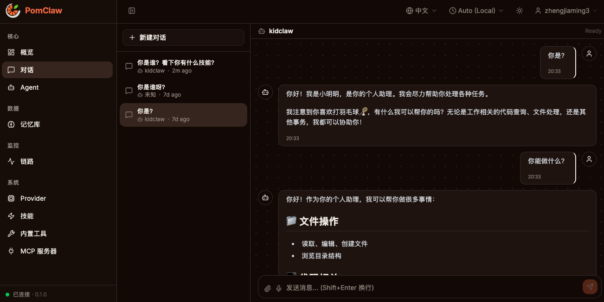

# PomClaw

**Enterprise-Grade Distributed AI Agent Platform**

<p>
  
  
  
  
  
</p>

[English](#-overview) | [中文](README.md)

---

## 📋 Table of Contents

- [Overview](#-overview)
- [Core Design Philosophy: API First](#-core-design-philosophy-api-first)
- [Technology Stack](#-technology-stack)
- [Core Features](#-core-features)
- [Quick Start](#-quick-start)
- [Architecture](#-architecture)
- [Configuration](#-configuration)
- [Use Cases](#-use-cases)
- [Performance & Scaling](#-performance--scaling)
- [Security](#-security)
- [Contributing](#-contributing)
- [License](#-license)

---

## 🎯 Overview

PomClaw is an enterprise-grade platform designed to deploy AI Agents at scale with minimal infrastructure costs. Unlike personal-use solutions that require one VM per Agent, PomClaw enables **unlimited Agents on shared infrastructure** through:

- **Distributed Memory Storage**: Unified database for all Agent memories, conversations, and state
- **SSH Sandbox Execution**: Secure, isolated workspace execution without individual VMs
- **Multi-Tenant Isolation**: Support thousands of Agents with fine-grained security controls
- **90% Cost Reduction**: Serve N agents with M compute nodes (M ≈ N/10)

### Quick Comparison

| Aspect | Traditional | PomClaw |
|--------|-----------|---------|
| **Architecture** | 1 VM per Agent | Shared infrastructure |
| **Cost for 100 Agents** | 100 × $10/mo = $1000 | 10 × $10/mo = $100 |
| **Storage** | Local files | Distributed database |
| **Execution** | Local compute | SSH sandbox pool |
| **Scalability** | Linear with agents | Linear with dataset |
| **Management** | Individual VMs | Centralized platform |

---

## 🎨 Core Design Philosophy: API First

PomClaw adopts an **API-First** development model. The core idea is:

> **One API definition generates both frontend and backend code, guaranteeing 100% protocol consistency.**

### Why API First?

In traditional frontend-backend separation, the most token-consuming (and time-consuming) process is **communicating and fixing protocol mismatches**:

```
Traditional: Discuss → Backend writes API → Frontend writes types → Integration finds field name mismatch → Fix backend → Fix frontend → Re-integrate...
            Massive time wasted on "field name alignment" and "type error debugging"
```

API-First:

```
API First: Edit docs/api/pomclaw.api → make generate → Frontend + Backend code auto-generated → Zero-error integration
```

**Key Advantages**:

| Aspect | Traditional | API First |
|--------|-----------|---------|
| **Type definitions** | Written twice (frontend + backend) | Auto-generated from single source |
| **Protocol consistency** | Manually maintained, prone to drift | Auto-generated, 100% consistent |
| **Integration time** | 30%+ of development cycle | Near zero |
| **Token consumption** | Repeated communication on field names, types, formats | Single definition, zero waste |
| **Change cost** | Modify backend + frontend + docs | Modify API definition → regenerate |
| **Error rate** | Manual typing errors (spelling, types, null handling) | Generated code, verified by goctl |

### Development Workflow

```
┌─────────────────────────────────────────────────────────────────┐
│                   1. Define API (Single Source of Truth)          │
│              docs/api/pomclaw.api                                │
│   type CreateAgentReq { display_name string; model string }      │
│   post /v1/agents (CreateAgentReq) returns (CreateAgentResp)     │
└──────────────────────────┬──────────────────────────────────────┘
                           │
                           ▼
┌─────────────────────────────────────────────────────────────────┐
│                   2. make generate (Auto-Generation)              │
│                                                                   │
│   ┌──────────────────────┐    ┌──────────────────────────────┐   │
│   │ Backend (goctl)       │    │ Frontend (goctl)             │   │
│   │                      │    │                              │   │
│   │ internal/handler/    │    │ ui/web/src/client/           │   │
│   │   createagenthandler.go│  │   pomclaw.ts (API methods)   │   │
│   │ internal/types/      │    │   pomclawComponents.ts (types)│   │
│   │   types.go           │    │                              │   │
│   └──────────────────────┘    └──────────────────────────────┘   │
└──────────────────────────┬──────────────────────────────────────┘
                           │
                           ▼
┌─────────────────────────────────────────────────────────────────┐
│                   3. Implement Business Logic (Hand-Written)      │
│                                                                   │
│   ┌──────────────────────┐    ┌──────────────────────────────┐   │
│   │ Backend:              │    │ Frontend:                    │   │
│   │ internal/logic/      │    │ src/hooks/use-*.ts(React Query)│   │
│   │   createagentlogic.go│    │   useCreateAgent()           │   │
│   │                      │    │ src/components/              │   │
│   │   // Business logic only│  │   agent-create-dialog.tsx   │   │
│   └──────────────────────┘    └──────────────────────────────┘   │
└─────────────────────────────────────────────────────────────────┘
```

### Step-by-Step Guide

#### 1️⃣ Define or Modify the API

Edit `docs/api/pomclaw.api`:

```api
// Define request/response types
type CreateAgentReq {
    DisplayName string `json:"display_name"`
    Model       string `json:"model"`
    ProviderID  int64  `json:"provider_id"`
}

type CreateAgentResp {
    Agent Agent `json:"agent"`
}

// Register route
service pomclaw {
    @doc "Create a new agent"
    @handler CreateAgent
    post /v1/agents (CreateAgentReq) returns (CreateAgentResp)
}
```

#### 2️⃣ Run Code Generation

```bash
make generate
```

This single command generates:

| Output | File | Description |
|--------|------|-------------|
| **Backend Handler** | `internal/handler/createagenthandler.go` | HTTP route handler (parameter parsing, auth, response wrapping) |
| **Backend Types** | `internal/types/types.go` | `CreateAgentReq` / `CreateAgentResp` Go structs |
| **Frontend API Methods** | `ui/web/src/client/pomclaw.ts` | `createAgent()` function |
| **Frontend TypeScript Types** | `ui/web/src/client/pomclawComponents.ts` | TypeScript interface definitions |

#### 3️⃣ Implement Business Logic

**Backend** — Write business logic in `internal/logic/createagentlogic.go`:

```go
func (l *CreateAgentLogic) CreateAgent(req *types.CreateAgentReq) (*types.CreateAgentResp, error) {
    // Just write business logic — parameters are already parsed, response auto-serialized
    agent, err := l.svcCtx.AgentModel.Insert(l.ctx, req.DisplayName, req.Model)
    if err != nil {
        return nil, err
    }
    return &types.CreateAgentResp{Agent: *agent}, nil
}
```

**Frontend** — Call via `useApiClient()`, which auto-injects auth:

```typescript
import { useApiClient } from "@/hooks/use-api-client";
import { useMutation } from "@tanstack/react-query";

function useCreateAgent() {
    const api = useApiClient();
    return useMutation({
        mutationFn: (req: CreateAgentReq) => api.createAgent(req),
    });
}
```

> `useApiClient()` automatically injects JWT token, tenant ID, and user ID — no manual auth handling needed.

### ⚠️ Important Rules

| File | Rule |
|------|------|
| `internal/handler/*.go` | **Do not edit** — overwritten on next `make generate` |
| `internal/model/*_gen.go` | **Do not edit** — auto-generated from database schema |
| `internal/types/*.go` | **Do not edit** — auto-generated from API definition |
| `ui/web/src/client/*.ts` | **Do not edit** — auto-generated from API definition |
| `internal/logic/*.go` | Hand-write business logic here ✅ |
| `ui/web/src/hooks/*.ts` | Hand-write React Query wrappers ✅ |
| `ui/web/src/components/*.tsx` | Hand-write UI components ✅ |

---

## 🏗️ Technology Stack

### Backend Framework Stack
- **[go-zero](https://github.com/zeromicro/go-zero)** — Enterprise Microservice Framework
  - `goctl` code generation: auto-generates HTTP handlers and types from API definitions
  - High-performance RPC and HTTP services
  - Built-in circuit breaker, rate limiting, timeout controls
  - Distributed tracing and observability

- **[eino](https://github.com/cloudwego/eino)** — AI Agent Engineering Framework
  - Modular Agent architecture
  - Flexible tool chains and plugin systems
  - Built-in memory, planning, and reasoning capabilities
  - Complete LLM integration support

### Frontend Technology Stack
- **React 19** + TypeScript — Modern frontend framework
- **Vite** — Ultra-fast build tool
- **Jotai** — Atomic state management
- **TanStack Router** — Type-safe routing solution
- **Tailwind CSS** — Utility-first styling framework
- **shadcn/ui** — Accessible UI component library

### Data Persistence
- **PostgreSQL / Oracle** — Enterprise relational databases
- **pgvector** — Vector search and semantic retrieval
- Complete multi-tenant data isolation

---

## ✨ Core Features

### 🗄️ Distributed Memory Storage
- **Unified Backend**: PostgreSQL, Oracle, or any SQL database
- **Vector Search**: Built-in pgvector support for semantic search
- **Multi-Tenant**: Automatic isolation of data across organizations/agents
- **Persistence**: Complete conversation history, state, and metadata

### 🏗️ SSH Sandbox Execution
- **Secure Isolation**: Execute code in isolated environments without VM overhead
- **Flexible Deployment**: Connect any Linux/Unix server as execution node
- **Load Balancing**: Automatic distribution across multiple sandbox nodes
- **Resource Control**: Built-in timeout and resource limits

### 💰 Enterprise Economics
- **Infrastructure Consolidation**: Run 100s of agents on same hardware
- **On-Demand Scaling**: Add SSH nodes as needed, not agents
- **Reduced Operational Burden**: Centralized logging, monitoring, and updates
- **Legacy Integration**: Works with existing on-premises infrastructure

### 🔒 Security & Compliance
- **Multi-Tenant RBAC**: Organization and agent-level access control
- **Audit Logging**: Complete operational audit trail
- **Network Isolation**: VPC support, SSH key management, bastion host compatible
- **Data Encryption**: In-transit and at-rest encryption options

### 📊 Observability
- **Unified Dashboard**: Monitor all agents from one place
- **Real-Time Logs**: Stream agent execution logs and errors
- **Performance Metrics**: CPU, memory, execution time tracking
- **Distributed Tracing**: Full request tracing across system

---

## 🚀 Quick Start (10 minutes)

### Prerequisites
- **Go 1.24+**
- **Node.js 18+** (for frontend build)
- **PostgreSQL 13+** (or Oracle Database)
- **SSH access to sandbox nodes**

### 1. Clone and Build

```bash
git clone https://github.com/pomclaw/pomclaw.git
cd pomclaw
make build  # Automatically builds both backend and frontend UI
```

> **Note**: `make build` automatically:
> - Compiles the frontend UI (using `npm run build`)
> - Compiles the backend binary
> - Packages frontend into `dist/control-ui/` directory

### 2. Initialize Database

```bash
# Create database
createdb pomclaw

# Import database schema
psql pomclaw < docs/sql/pom_meta.sql
psql pomclaw < docs/sql/pom_users.sql
psql pomclaw < docs/sql/pom_agents_v2.sql
psql pomclaw < docs/sql/pom_config.sql
psql pomclaw < docs/sql/pom_memories.sql
psql pomclaw < docs/sql/pom_prompts.sql
psql pomclaw < docs/sql/pom_sessions.sql
psql pomclaw < docs/sql/pom_transcripts.sql
psql pomclaw < docs/sql/pom_daily_notes.sql
psql pomclaw < docs/sql/pom_state.sql
```

### 3. Start Gateway

```bash
./build/pomclaw

# Gateway starts on http://localhost:18790
# Frontend UI automatically served from: http://localhost:18790 (using dist/control-ui)
```

**Gateway Web UI:**



---

## 📋 Architecture

```
┌──────────────────────────────────────────────────────────┐
│           Distributed Database (PostgreSQL/Oracle)        │
│  - Memories, conversations, state (multi-tenant)         │
│  - Vector embeddings with pgvector                       │
└──────────────────────────────────────────────────────────┘
                          ↑
                ┌─────────┼─────────┐
                ↓         ↓         ↓
         ┌──────────┐┌──────────┐┌──────────┐
         │SSH Node1 ││SSH Node2 ││SSH Node3 │
         │(Sandbox) ││(Sandbox) ││(Sandbox) │
         └──────────┘└──────────┘└──────────┘
                ↑         ↑         ↑
                └─────────┼─────────┘
                          │
    ┌─────────────────────┴─────────────────────┐
    │     PomClaw Gateway API + WebSocket        │
    │  (Single control plane for all agents)     │
    └─────────────────────┬─────────────────────┘
         ↑                 ↑                ↑
    ┌────────────┐   ┌────────────┐   ┌────────────┐
    │  Agent-1   │   │  Agent-2   │   │  Agent-N   │
    └────────────┘   └────────────┘   └────────────┘
```

### Code Architecture

```
pomclaw/
├── docs/api/pomclaw.api          # 🎯 API definition (single source of truth)
├── cmd/pomclaw/                   # Entry point
├── internal/
│   ├── handler/                   # ⚠️ Auto-generated (HTTP routes)
│   ├── types/                     # ⚠️ Auto-generated (request/response types)
│   ├── logic/                     # ✅ Hand-written business logic
│   ├── model/                     # ⚠️ Auto-generated (database CRUD)
│   ├── storage/                   # ✅ Data access layer
│   ├── agent/                     # ✅ Agent loop
│   ├── svc/                       # ✅ Dependency injection
│   ├── tools/                     # ✅ Tool implementations
│   └── contracts/                 # ✅ Interface definitions
├── ui/web/
│   ├── src/
│   │   ├── client/                # ⚠️ Auto-generated (API methods + types)
│   │   ├── hooks/                 # ✅ React Query wrappers
│   │   ├── components/            # ✅ UI components
│   │   ├── pages/                 # ✅ Pages
│   │   └── stores/                # ✅ State management
│   └── ...
├── etc/                           # YAML configuration
└── Makefile                       # Build + code generation
```

---

## 🔧 Configuration

### Database Configuration

```json
{
  "storage_type": "postgres",
  "postgres": {
    "enabled": true,
    "host": "db.example.com",
    "port": 5432,
    "database": "pomclaw",
    "user": "pomclaw",
    "password": "${POSTGRES_PASSWORD}",
    "ssl_mode": "require",
    "pool_max_open": 25,
    "pool_max_idle": 5
  }
}
```

---

## 📚 Use Cases

### 🏢 Enterprise AI Customer Support
Scale from 10 to 1000+ support agents without proportional cost increase

### 🤖 Workflow Automation Platform
Distributed task execution engine for RPA, data processing, and business logic automation

### 📊 Data Analysis at Scale
Multi-tenant analytics platform with isolated workspaces for each user/organization

### 🔬 Research Computing
High-availability compute clusters for scientific simulations and data processing

### 🎓 Educational Platform
Manage AI assistants for thousands of students with isolated, secure workspaces

---

## 📊 Performance & Scaling

### Capacity Planning

| Configuration | Agents | Memory/Agent | CPU | Database |
|--------------|--------|-------------|-----|----------|
| Small | 100 | 256MB | 2-4 core | PostgreSQL 13 |
| Medium | 1,000 | 256MB | 8-16 core | PostgreSQL 14 |
| Large | 10,000 | 256MB | 32+ core | PostgreSQL 14+ or Oracle 21c |
| Enterprise | 100,000+ | 256MB | Multi-node | Distributed DB |

### Storage Requirements

- **Per Agent**: ~1MB metadata + 10MB conversations (varies by usage)
- **Vector Storage**: ~1,500 bytes per memory (384-dim embedding)

---

## 🔒 Security

### Authentication & Authorization
- JWT token authentication
- Organization-level and agent-level RBAC
- API key management with rotation

### Network Security
- SSH key-based authentication (no passwords)
- TLS 1.3 for all communications
- VPC/network isolation support
- Bastion host support for air-gapped deployments

### Data Protection
- Encryption at rest (database-level)
- Encryption in transit (TLS)
- Audit logging for all operations
- Data retention and compliance policies

---

## 🤝 Contributing

Contributions welcome! Please:

1. Fork the repository
2. Create a feature branch (`git checkout -b feature/amazing-feature`)
3. Commit your changes (`git commit -m 'Add amazing feature'`)
4. Push to the branch (`git push origin feature/amazing-feature`)
5. Open a Pull Request

### Development Principles

- **API First**: Edit `docs/api/pomclaw.api` → `make generate` → implement business logic
- **Never edit generated files**: handler/, types/, client/ directories are overwritten on regenerate
- **Follow existing code style**: use `gofmt` and the project's ESLint configuration

---

## 📜 License

MIT License - see [LICENSE](LICENSE) file for details

---

## 📞 Support

- **Issues**: [GitHub Issues](https://github.com/pomclaw/pomclaw/issues)
- **Discussions**: [GitHub Discussions](https://github.com/pomclaw/pomclaw/discussions)
- **Enterprise Support**: contact@pomclaw.com

---

## 🎉 Acknowledgments

PomClaw builds on the excellent work of:
- go-zero and eino communities
- Open source database and SSH communities
- Go ecosystem contributors